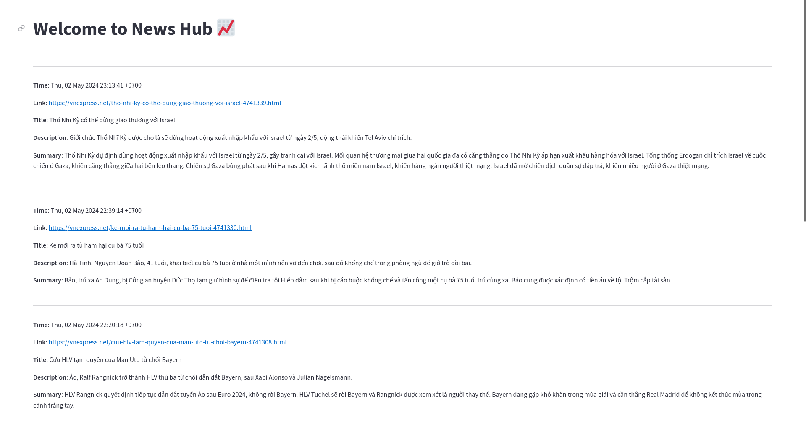

# News-Summarizer

<p align="center">
  
</p>

## Installation
You can use [Miniconda](https://docs.anaconda.com/free/miniconda/miniconda-install/) or [Mamba](https://mamba.readthedocs.io/en/latest/installation/mamba-installation.html) (recommended) to create Python environments. Here I use Anaconda for simplicity.
```
$ conda create -n news python=3.12
$ conda activate news
$ pip install -r requirements.txt
```

## Running
- Edit the [config file](./scraper_config.yml). You can change the `article_type` variable to the channel you want to scrape the news in [VnExpress RSS web page](https://vnexpress.net/rss). In this repo, the `article_type` is set to `tin-moi-nhat` to scrape the contents from [https://vnexpress.net/rss/tin-moi-nhat.rss](https://vnexpress.net/rss/tin-moi-nhat.rss). It's that simple.
- Run the script: `sh run.sh` (Maybe you have to add execute permission to this file).
